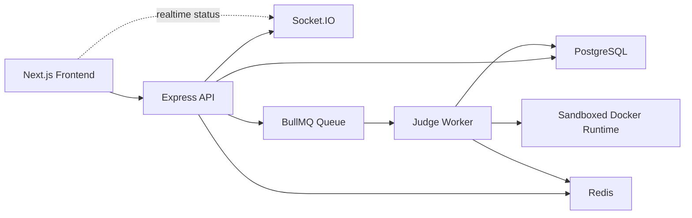
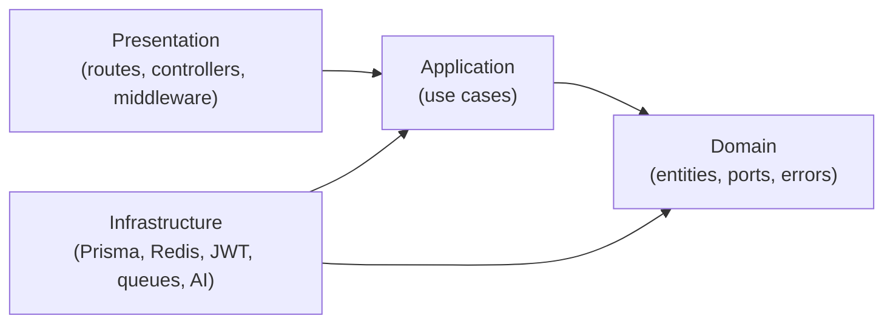

# interviewUndo Platform

interviewUndo is a LeetCode-style interview practice platform focused on JavaScript, React, Node.js, and TypeScript. It combines a modern Next.js frontend, a clean-architecture Express API, and a judge worker that executes user code inside sandboxed Docker containers.

## Highlights

- Authentication with email/password JWT flow and GitHub OAuth
- Searchable problem catalog with filtering, daily challenges, and AI hints
- Real-time submission lifecycle updates with Socket.IO
- Sandboxed code execution using BullMQ, Redis, Docker, and a dedicated judge worker
- Dashboard analytics for streaks, activity, and progress by category
- Admin workflows for problem and test-case management
- Interactive OpenAPI docs at `/api-docs`

## Architecture



### Backend layering



## Monorepo layout

```text
apps/
  frontend/        Next.js app router frontend
  backend-api/     Express API with clean architecture
  judge-worker/    BullMQ worker for sandboxed code execution
packages/
  shared-types/    Shared DTOs, enums, entities, Zod schemas
  shared-utils/    Shared utilities
infrastructure/
  docker-compose.yml
```

## Tech stack

| Area      | Stack                                                               |
| --------- | ------------------------------------------------------------------- |
| Frontend  | Next.js, React, TypeScript, Tailwind CSS, shadcn/ui, TanStack Query |
| Backend   | Express 5, TypeScript, Prisma, PostgreSQL                           |
| Auth      | jose, argon2, next-auth                                             |
| Realtime  | Socket.IO                                                           |
| Queueing  | BullMQ, Redis                                                       |
| Execution | Docker, dockerode                                                   |
| Testing   | Vitest, Supertest, Playwright                                       |
| Tooling   | Turborepo, ESLint, Prettier, Husky                                  |

## Getting started

### Prerequisites

- Node.js 22+
- npm 10+
- Docker Desktop

### Installation

```bash
git clone https://github.com/YOUR_USERNAME/interview-prep-platform.git
cd interview-prep-platform
npm install
cp .env.example .env
docker compose -f infrastructure/docker-compose.yml up -d
npm run db:migrate
npm run db:seed
npm run dev
```

### Default local URLs

- Frontend: `http://localhost:3000`
- Backend API: `http://localhost:4000`
- Swagger UI: `http://localhost:4000/api-docs`
- OpenAPI JSON: `http://localhost:4000/api-docs.json`

## Environment variables

The backend validates environment variables on startup. These are the key values you need locally:

```env
DATABASE_URL=
REDIS_URL=
JWT_ACCESS_SECRET=
JWT_REFRESH_SECRET=
JWT_ACCESS_EXPIRY=15m
JWT_REFRESH_EXPIRY=7d
PORT=4000
NODE_ENV=development
FRONTEND_URL=http://localhost:3000
CORS_ORIGINS=http://localhost:3000
RATE_LIMIT_WINDOW_MS=900000
RATE_LIMIT_MAX_REQUESTS=100
GROK_API_KEY=
GROK_MODEL=grok-2
```

## Useful scripts

| Script               | Purpose                           |
| -------------------- | --------------------------------- |
| `npm run dev`        | Start the monorepo in development |
| `npm run build`      | Build all workspaces              |
| `npm run lint`       | Run linting across the repo       |
| `npm run typecheck`  | Run TypeScript checks             |
| `npm run test`       | Run unit and integration tests    |
| `npm run test:e2e`   | Run Playwright end-to-end tests   |
| `npm run db:migrate` | Apply Prisma migrations           |
| `npm run db:seed`    | Seed sample data                  |
| `npm run db:studio`  | Open Prisma Studio                |

## API overview

The API is documented with Swagger/OpenAPI and exposed through `swagger-jsdoc` + `swagger-ui-express`.

### Main endpoint groups

- `Auth`: register, login, refresh token, GitHub auth
- `Problems`: list problems, fetch by slug, daily challenge, AI hint generation
- `Submissions`: submit code, run playground code, list submissions, fetch result details
- `Dashboard`: summary metrics, progress, heatmap, recent activity
- `Admin`: stats, problem CRUD, test-case CRUD
- `Health`: liveness and readiness probes

## Delivery flow

1. A user opens a problem in the frontend and writes code in Monaco.
2. The frontend submits code to the Express API.
3. The API stores the submission and enqueues a BullMQ job.
4. The judge worker executes the code inside a constrained Docker container.
5. The worker saves the result and publishes status updates.
6. Socket.IO pushes those updates back to the user interface in real time.

## Testing

The repo includes:

- Unit tests for use cases with Vitest
- Route-level integration tests with Supertest
- End-to-end user-path tests with Playwright

Run backend and integration coverage:

```bash
npm run test
```

Run browser flows:

```bash
npm run test:e2e
```

## Production notes

- Frontend is designed for deployment on Vercel
- Backend and judge worker are suited for Docker-based VPS deployment
- PostgreSQL can run on Supabase or a managed Postgres provider
- Redis is required for queues, cache, and realtime worker updates

## License

MIT
