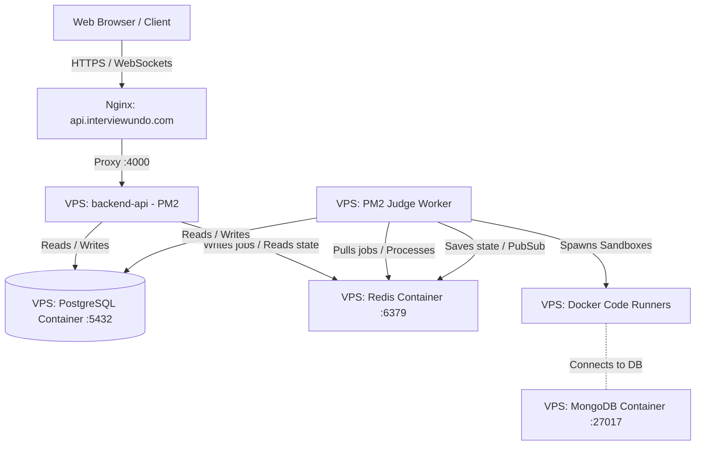

# VPS Deployment & Configuration Guide

This document contains all details regarding the infrastructure on the Hostinger VPS, including deployed services, folder structures, configuration details, and common commands for maintenance.

> **Note for contributors / forks**: All sensitive values (IPs, passwords, secrets) are shown as `<PLACEHOLDER>` in this file. Real values are stored only in `.env` files on the server, which are never committed.

---

## 1. System Architecture

All services are fully self-hosted on the Hostinger VPS:



- **Database (PostgreSQL):** Self-hosted on **Hostinger VPS** in a Docker container. _(Previously: Neon free tier)_
- **Backend API:** Self-hosted on **Hostinger VPS** via PM2. _(Previously: Render free tier)_
- **Nginx:** Reverse proxy with HTTPS (Let's Encrypt) at `api.interviewundo.com`.
- **Redis:** Hostinger VPS, Docker container (unchanged).
- **MongoDB:** Hostinger VPS, Docker container (unchanged).
- **Judge Worker:** Hostinger VPS, PM2 process (unchanged).

---

## 2. VPS Specifications

- **Hosting Provider:** Hostinger VPS
- **RAM:** 8 GB
- **Operating System:** Ubuntu / Debian (standard)
- **Public IP Address:** `<VPS_IP>` _(store privately — never commit)_
- **Backend URL:** `https://api.interviewundo.com`
- **Frontend URL:** `https://interviewundo.vercel.app`

---

## 3. Folder & File Structure

```text
/
├── var/www/interview-undo/            # Project codebase (git repo)
│   ├── apps/
│   │   ├── backend-api/
│   │   │   ├── .env                  # Production env vars (DO NOT COMMIT)
│   │   │   └── dist/server.js        # Built output (run by PM2)
│   │   └── judge-worker/
│   │       ├── .env                  # Worker env vars (DO NOT COMMIT)
│   │       └── dist/index.js         # Built output (run by PM2)
│   ├── ecosystem.config.js           # PM2 process config (gitignored — has cwd paths)
│   └── package.json
├── root/
│   └── redis-prod/
│       └── docker-compose.yml        # PostgreSQL + Redis + MongoDB containers
└── etc/
    └── nginx/
        └── sites-available/
            └── interviewundo-api     # Nginx reverse proxy config
```

---

## 4. Service Configurations

### A. PostgreSQL, Redis & MongoDB (`~/redis-prod/docker-compose.yml`)

All three databases run in Docker. PostgreSQL is bound to `127.0.0.1` only (not publicly exposed). See `files/vps-docker-compose.yml` in this repo for the full template — **replace all `<PLACEHOLDER>` values** before using on the server.

Key settings:

- **Postgres**: bound to `127.0.0.1:5432` only (not internet-exposed)
- **Redis**: password-protected, 1GB RAM cap, AOF persistence
- **Mongo**: used only by code execution sandbox containers

### B. Linux Kernel Adjustments

1. **Overcommit Memory (`vm.overcommit_memory = 1`):** In `/etc/sysctl.conf`. Allows Redis to fork for background saves.
2. **Transparent Huge Pages (THP) Disabled:** Via `/etc/rc.local`. Prevents memory latency spikes.

### C. Nginx Reverse Proxy (`/etc/nginx/sites-available/interviewundo-api`)

Handles HTTPS termination and proxies traffic to the backend. Includes special handling for Socket.IO WebSocket upgrades. SSL certificate managed by Certbot (Let's Encrypt, auto-renews). See `files/nginx-interviewundo-api.conf` for the full template.

### D. Docker Sandbox Runners

The judge worker requires these Docker images (`docker images`):

- `node-mongodb-runner:latest`
- `node-react-runner:latest`
- `node-sql-runner:latest`
- `node:22-slim` (base image)

---

## 5. Connection Strings (`.env`)

Real values are **never committed**. These are the variable names and formats used:

### Backend API (`/var/www/interview-undo/apps/backend-api/.env`)

```env
DATABASE_URL="postgresql://<DB_USER>:<DB_PASSWORD>@127.0.0.1:5432/interviewprep?schema=public"
REDIS_URL="redis://:<REDIS_PASSWORD>@127.0.0.1:6379"
JWT_ACCESS_SECRET="<min 32 char secret>"
JWT_REFRESH_SECRET="<min 32 char secret>"
JWT_ACCESS_EXPIRY="15m"
JWT_REFRESH_EXPIRY="7d"
PORT=4000
NODE_ENV="production"
FRONTEND_URL="https://interviewundo.vercel.app"
CORS_ORIGINS="https://interviewundo.vercel.app"
AUTH_SHARED_SECRET="<min 16 char secret>"
RATE_LIMIT_WINDOW_MS=900000
RATE_LIMIT_MAX_REQUESTS=100
```

### Judge Worker (`/var/www/interview-undo/apps/judge-worker/.env`)

```env
DATABASE_URL="postgresql://<DB_USER>:<DB_PASSWORD>@127.0.0.1:5432/interviewprep?schema=public"
REDIS_URL="redis://:<REDIS_PASSWORD>@127.0.0.1:6379"
```

> Generate secrets with: `openssl rand -hex 32`

---

## 6. Maintenance Commands

### Managing Code & Deployments

Run inside `/var/www/interview-undo`:

```bash
git pull origin main                                          # Pull latest code
npm install                                                   # Install dependencies
npx turbo run build --filter=@interviewprep/backend-api      # Build backend only
npx turbo run build --filter=@interviewprep/judge-worker     # Build worker only
npm run build                                                 # Build all

# Apply DB migrations after code changes
NODE_ENV=production npx prisma migrate deploy \
  --schema=apps/backend-api/src/infrastructure/database/prisma/schema.prisma
```

### Managing PM2 Processes

```bash
pm2 list                                     # List all processes
pm2 logs interview-undo-backend --lines 50   # Backend logs
pm2 logs interview-undo-worker --lines 50    # Worker logs
pm2 restart interview-undo-backend           # Restart backend
pm2 restart interview-undo-worker            # Restart worker
pm2 restart all                              # Restart both
pm2 save                                     # Persist process list
pm2 startup                                  # Generate auto-start script (run once)
```

### Managing Docker Containers (Databases)

Run inside `~/redis-prod`:

```bash
docker compose up -d            # Start all containers
docker compose up -d postgres   # Start only postgres
docker compose down             # Stop all
docker compose logs -f          # Live logs
docker ps                       # Check container status

# Postgres shell
docker exec -it interviewprep-postgres psql -U <DB_USER> -d interviewprep

# Redis CLI
docker exec -it redis_app redis-cli
auth <REDIS_PASSWORD>

# Mongo shell
docker exec -it interviewprep-mongo mongosh
```

### Managing Nginx & SSL

```bash
nginx -t                          # Test config
systemctl reload nginx            # Reload config (no downtime)
systemctl restart nginx           # Full restart
certbot renew --dry-run           # Test SSL auto-renewal
certbot renew                     # Force renew certificate
```

---

## 7. Deployment Workflow (Code Updates)

When you push new code and want to deploy to VPS:

```bash
cd /var/www/interview-undo
git pull origin main
npm install
npx turbo run build --filter=@interviewprep/backend-api

# If schema changed:
NODE_ENV=production npx prisma migrate deploy \
  --schema=apps/backend-api/src/infrastructure/database/prisma/schema.prisma

pm2 restart interview-undo-backend
pm2 logs interview-undo-backend --lines 20
```

---

## 8. Security Checklist

1. **PostgreSQL port `5432`:** Bound to `127.0.0.1` only — not exposed to internet. ✅
2. **Redis port `6379`:** Close in Hostinger firewall after Render is retired (no longer needed externally).
3. **HTTPS:** Nginx + Let's Encrypt certificate. Auto-renews via Certbot cron. ✅
4. **No secrets in git:** All `.env` files are gitignored. This guide uses `<PLACEHOLDER>` values only. ✅
5. **Firewall (UFW/Hostinger panel):** Open: `22` (SSH), `80` (HTTP), `443` (HTTPS). Close: `6379`, `5432`, `27017`.

---

## 9. Data Backup Commands

```bash
# Backup PostgreSQL (run on VPS)
docker exec interviewprep-postgres pg_dump \
  -U <DB_USER> interviewprep \
  -F c > ~/backups/postgres-$(date +%Y%m%d).dump

# Restore PostgreSQL from backup
docker exec -i interviewprep-postgres pg_restore \
  -U <DB_USER> -d interviewprep \
  < ~/backups/postgres-YYYYMMDD.dump
```

Persistent data volumes (back these up periodically):

- PostgreSQL: `/var/lib/docker/volumes/redis-prod_postgres_data/_data`
- Redis: `/var/lib/docker/volumes/redis-prod_redis_data/_data`
